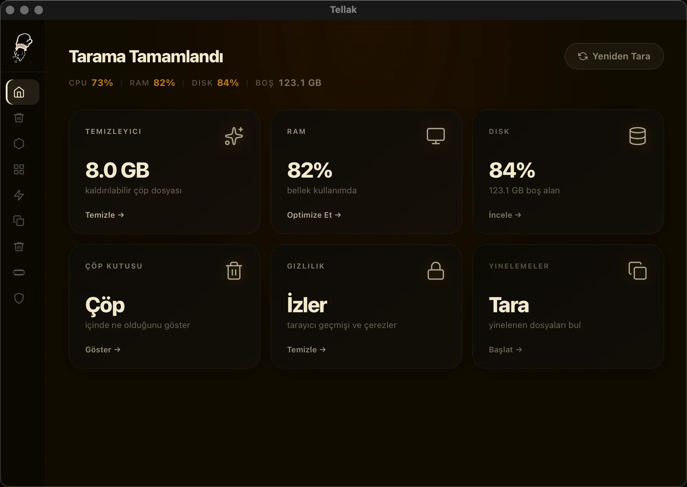

# Tellak

A fast, native macOS system cleaner built with Tauri 2, React 19, and Rust.


No subscription. No telemetry. Nothing auto-deleted. Apple-notarized. Open source.



**[Download for macOS →](https://tellak.app)** &nbsp;·&nbsp; [tellak.app](https://tellak.app)

## Features

| Feature | Description |
|---|---|
| **Cleaner** | Scan and remove junk files, caches, logs, dev tool artifacts, and language files |
| **Disk Browser** | Drill into any folder with a recursive size tree to find what's eating your disk |
| **Uninstaller** | List and remove apps cleanly |
| **Startup Manager** | View and toggle login items and launch agents/daemons |
| **Duplicate Finder** | Fast SHA-256 parallel duplicate detection with keep strategy picker |
| **Trash** | Browse, restore, or permanently delete trash items with thumbnails |
| **RAM Booster** | Free up memory pressure with a single click |
| **Privacy Cleaner** | Clear browser history, cookies, DNS cache, and clipboard |

## Requirements

- macOS 12 Monterey or later (Apple Silicon or Intel)
- No additional runtime required — fully native

> **Safe by design:** nothing is auto-deleted — Tellak scans, shows you everything with sizes, and waits for your call. Removed items go to the Trash via Finder, never `rm`. No telemetry, no account, no network calls. Every release is signed with an Apple Developer ID and notarized by Apple.

## Building from Source

**Prerequisites:**
- [Rust](https://rustup.rs/) (stable)
- [Node.js 18+](https://nodejs.org/)
- Xcode Command Line Tools: `xcode-select --install`

```bash
# Clone the repo
git clone https://github.com/kaanses/Tellak.git
cd Tellak

# Install JS dependencies
npm install

# Run in development (two terminals)
npm run dev                    # terminal 1 — Vite dev server
cd src-tauri && cargo run      # terminal 2 — Tauri app

# Production build
npm run build
npx tauri build
# Output: src-tauri/target/release/bundle/
```

## Tech Stack

- **Frontend:** React 19, TypeScript, Vite, Tailwind CSS v4, Zustand, React Router
- **Backend:** Rust, Tauri 2, sysinfo, walkdir, sha2, rayon

## Contributing

Pull requests are welcome. For significant changes, open an issue first to discuss what you'd like to change.

## License

[MIT](LICENSE)
